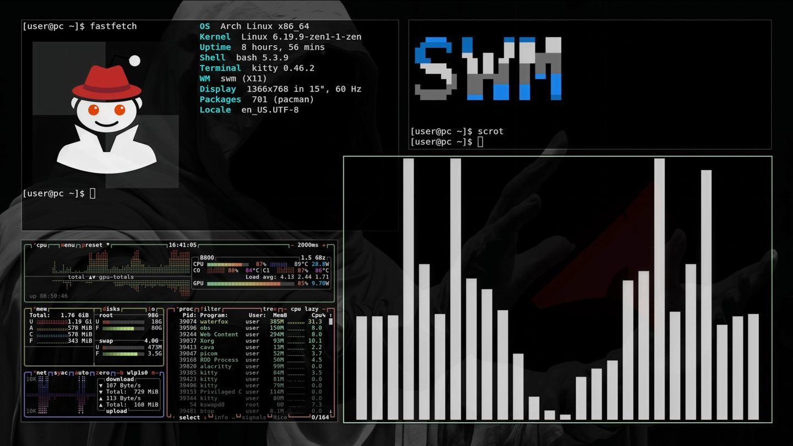
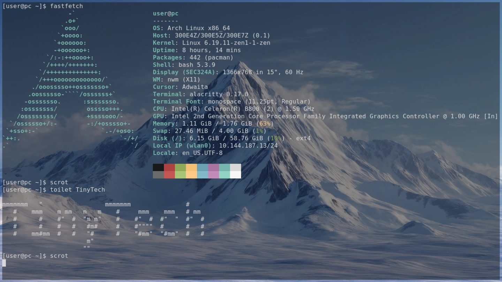
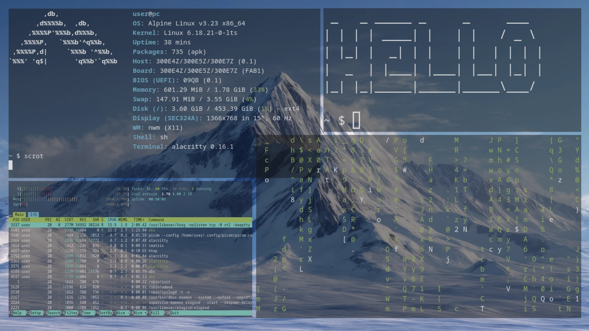
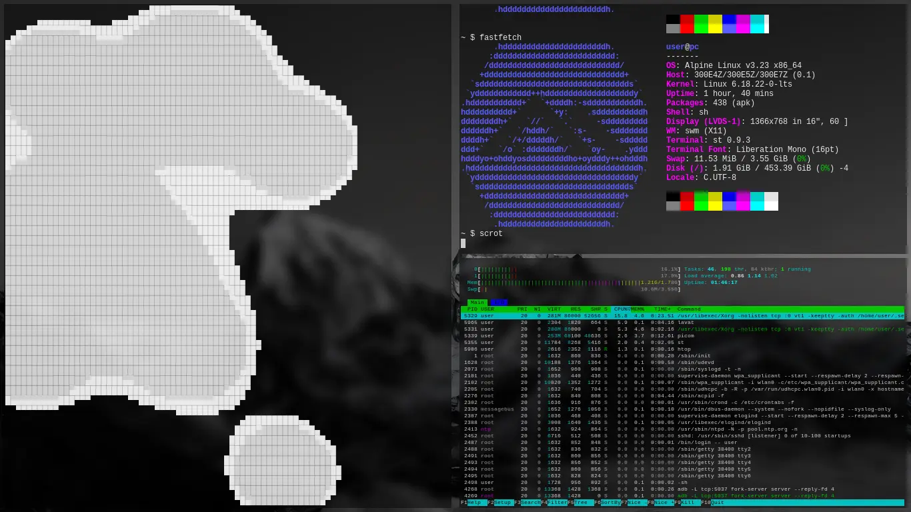

# 🐧 distrohop

> A visual log of systems I've used and configured.  
> *From minimal Alpine containers to fully riced Arch setups.*

  « Screenshot collection — work in progress »

---

## 🎴 Arch Linux

*Primary workstation. Tiling window managers, custom kernel tweaks, and a clean dark aesthetic.*

  
  

---

## ⛰️ Alpine Linux

*The lightweight powerhouse. Used for containers, VMs, and testing on ancient hardware. Busybox supremacy.*

  
  

---

## 📋 Collection Notes

- **Why?** Because dotfiles tell *what* you use, but screenshots tell *how* you use it.
- **Format:** All images are optimized WebP.
- **Status:** Actively updated as I break and rebuild things.

   
  

